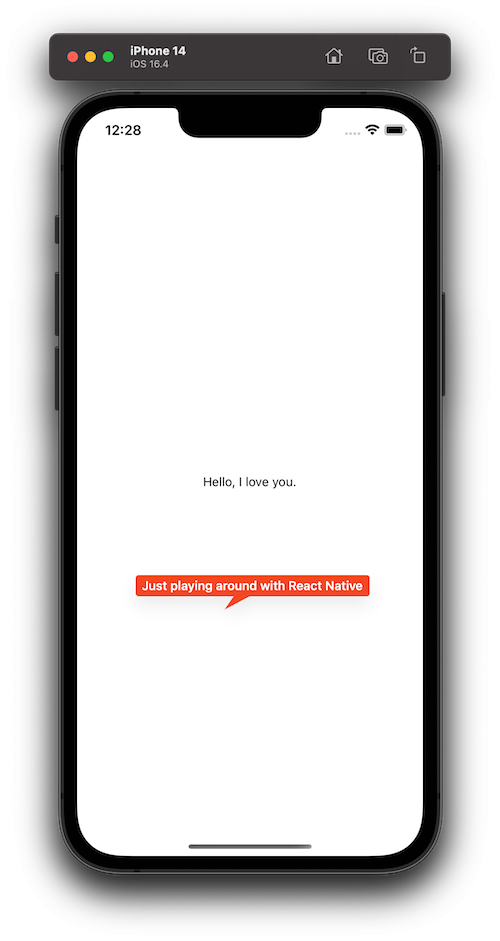

# My Test IOS App with React Native

Messing around a bit making an IOS app with react native and teasing my wife




## Step 1: Start the Metro Server

```bash
# using npm
npm start

# OR using Yarn
yarn start
```

## Step 2: Start app

### For iOS

```bash
# using npm
npm run ios

# OR using Yarn
yarn ios
```
